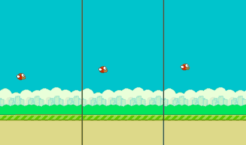

# Flappy Bird with Reinforcement Learning

## What is flappybird_rl?

This repository provides the python code for the training of a basic Reinforcement Learning agent to play the Flappy Bird game.
More details about this project can be found in the related Medium blog post: [comming soon].



A Reinforcement Learning project requires two main pieces: an environment and an agent. In our case the environment is the Flappy Bird game and we will train an agent to play this game. Thus, this repository contains:
- code and explanations to wrap a given environment (here from PyGame Learning Environment) to turn it into an OpenAI Gym environment and to make it easily compatible with a keras-rl agent
- code and explanations to train an agent with respect to a given Gym Environment (using the keras-rl library)
- a dockerfile to build a docker image that will contains all the required dependancies to run the code of this repository


## About the environment

In order to set up the environment, you will need PyGame Learning Environment (PLE), python-opengl, xvfb, ffmpeg and different python libraries (Gym, pygame) to be installed. All the required installations are specified in the Dockerfile.

The Flappy Bird environment can be found in the PyGame Learning Environment (PLE) library. In order to be able to use the keras-rl library to define your agent easily, you can first wrap this environment so that to obtain a standard OpenAi Gym environment (see code of flappy_environement.py for details). The wrapper should inherit from the Gym.Env class and must implement at least 5 functions:

### __init__(self,...)

This function is the one that create our environment. It must set all the needed variables for the game to be launched as well as define variables the agent will use. It must at least:
- Launch the first game
- Define a `self.action_space` that represents the number of different actions possible for the agent
- Define a `self.observation_space` that represents what the agent will receive as observation (state) from the world

Note that this function can accept more than just the self argument. We will describe later how we used this particularity.

### seed(self, seed=None)

This function is always the same and it is just used for showcase, to be sure the results are repeatable.

### step(self,action)

This function should make the environment play one step of the game based on the player's action. It returns an observation of the world, a reward, a boolean defining wether the game is over or not and a dictionary containing any additional information you may want to keep track of.

As we are using the PLE implementation of Flappy Bird, we can wrap the function `act(action)` provided by PLE that does exactly that job. Notice that the actions PLE expects are 119 for flapping and None to stay still and so we need to re-map the 0/1 (flap/stay still) of our model. Moreover, as mentioned in the code, a bug in the PLE makes the player loose all velocity if he choose to flap at two consecutive frames. As this allows the agent to cheese the game, it has been addressed by playing two turn when asked to flap: one flap and one stay still turn.

### reset(self)

This function should reset the game and return an observation of the new world.

### render(self, mode='human', close=False)

This function is optional, however it is the one that allows us to get the videos of how well our agent is doing. To get a good overview of our agent performances, it is recommended to implement it. To be usable by the Monitor wrapper we used, it must be able to return an array representing the RGB image of the screen if the `mode` asked is rgb_array.

### Notes about the Monitor

As we want to get a video of the agent, we use the Monitor wrapper of the gym environment that allows us to record the chosen games. However, notice that if you are working in a docker, the screen can't be acceded by the code. To avoid this problem, you can use the xvfb (screen emulator) that is included in the docker. Once this program installed, instead of running the script as `python3 myscrip.py` one should run `xvfb-run -s "-screen 0 640x480x24" python3.6 myscrip.py` it will simulate a screen making the Monitor recording possible.

### Notes about the observation_space

For the state, we have defined our wrapper so that to be able to train the agent on two variants of the environment:
- in the first case (`env_state="vector"`) the state returned by the environment is a vector that contains 8 variables: player y position (how high is the player), player velocity, distance to the next pipe, height of the top of the next pipe, height of the bottom of the next pipe, distance to the next next pipe, height of the top of the next next pipe, height of the bottom of the next next pipe. Note that the y axis is inverted meaning that a velocity of X with X < 0 makes the player goes up
- in the second case (`env_state="vector"`) the state returned by the environment is directly a 2D array that corresponds to the "game screen" (resized and converted into black and white to make the training time reasonable)

Note that we can add this env_state parameter to the `__init__()` function. However, we never directly create an environment ourself, we should call gym.make(). Thankfully, the possibility that an environment could need initialisation parameter is covered by gym meaning that when using the `gym.make()` function, we can add that parameter.

### Notes about how to use the custom environment

Once we have defined a custom gym environment class by implementing the required functions, we still need to install this custom gym as a library the following way. We should create a folder that will be installed with `pip install -e /PATH/TO/folder_to_install`. This folder must be structured as follows:

folder_to_install
|
|—— setup.py
|—— my_custom_gym_lib
    |
    |—— __init__.py
    |—— envs
        |
        |—— __init__.py
        |—— custom_env.py

setup.py should contain the following code:

```python
from setuptools import setup
setup(name='my_custom_gym_lib',
      version='NUMBER_OF_THE_VERSION',
      install_requires=['REQUIERED_PACKAGES']
)
```

In the my_custom_gym_lib folder, the __init__.py should contain the following code:

```python
from gym.envs.registration import register
register(id='NAME_OF_YOUR_ENVIRONEMENT',
    entry_point='my_custom_gym_lib.envs:NAME_OF_THE_CUSTOM_GYM_CLASS',
)
```

Lastly in the envs folder, you should have the python code (that we called custom_env here) that contain your custom environement and a __init__.py containing the following code :

```python
from my_custom_gym_lib.envs.custom_env import NAME_OF_THE_CUSTOM_GYM_CLASS
```

With this architecture, you can install your custom gym by running `pip install -e /PATH/TO/folder_to_install`. To use it just add `import my_custom_gym_lib` and  `gym.make('NAME_OF_YOUR_ENVIRONEMENT')` to your code.


## About the agent

In order to set up the agent, you will need tensorflow, keras-rl to be installed.

Once the environment has been turned into a Gym environment, you can use keras and keras-rl libraries easily to define and train your agent. In order to set up your agent for its training, you need to create an environment with the gym.make('ENVIRONEMENT_NAME') function. Then if you wish to record the training and testing of the agent, you must wrap your environment with `Monitor(env, "./RECORDING_FOLDER", force=True, video_callable=function)`. Note that video_callable should be a function taking as an argument the `episode_id` and returning true (episode recorded) or false (episode not recorded). It is not recommended to record every episode in the training session as it will slow the process a lot!

Then you must create the "agent brain": a neural network that takes as input the environment state during the last X steps with X the window_length of the Memory that we will describe later. Considering more than only the current state is important for example when working with the image of the screen: in this case, a single frame doesn't allow the agent to know the velocity of an object, just its position. The neural network will of course have a last layer of size env.action_space (see __init__ for more details).

With the environment and the "brain" of our agent created, we still need to define its memory. The memory `limit` of the agent define how many steps (not games) he will store for experience replay. With a limit of 1000, at the 2000th step, when training our network, we will only take steps in the last 1000th rather than in the whole experience our agent has had. This parameter is useful as old games may be irrelevant if the agent has become significantly better at playing the game. The memory should also have a `window_length` that define how many step states in the past it will give to the agent when this one needs to take a decision. It should not be too small as the agent may loose informations as described earlier and should neither be too long as it will make the neural network bigger (and so, longer to train and to use).

Now that our agent has an environment in which he can act, a brain and a memory, it still need a policy to follow. We choose the epsilon greedy policy as it is the most standard one and we combined it with a LinearAnnealedPolicy in order to get more exploration at the start of the training (eps high) than at the end of it (eps low). Moreover it allows us to set the eps (exploration rate) at zero when testing our agent to get to see its real performances.

## Some results and numbers

### Vector mode

Here are some results we obtained when training our Flappy agent in the "vector" mode (the observations are vectors of length 8 describing the state of the environment). The model trained is a feed-forward neural network (input=8, 16, 16, 8, output=2) for a total of 570 parameters.

Notice that the training of 50000 steps took around 5 minutes. The following results have been obtained on testing mode, with full exploitation and no exploration (eps=0), and for 10 episodes.

| | Worst score | Best score | Mean score |
|-|-------------|-------------|-------------|
| 0 step (0 episode) | 0 | 0 | 0 |
| 50000 steps (674 episodes) | 0 | 34 | 8.7 |
| 100000 steps (1171 episodes) | 1 | 85 | 23.4 |
